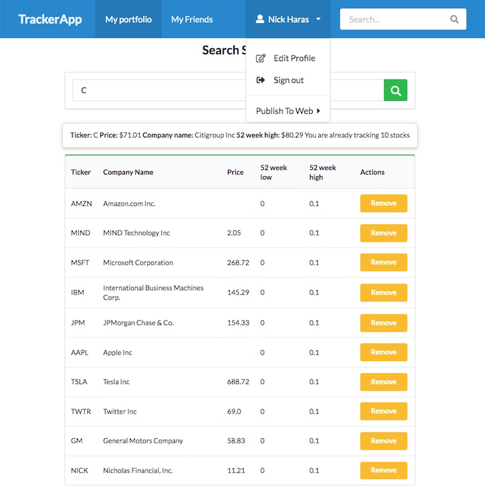

# Stock tracker with friends

This is the finance tracker app from the Complete Ruby on Rails Developer course. It uses devise gem to implement sign-up and log-in user functionality. After logging in the users go to their portfolio page. There is the possibility to search for stocks and add them to the list of tracked stocks.

### Features

- Users can
  - Create an account
  - Search for stocks and track them
  - Search for other users and follow them
  - See what stocks their friends are following and add them to their portfolio

### Screenshot



### Live link

The project is hosted on Heroku. Please give it some time to load the first time.
[Finance Tracker](https://quiet-waters-10593.herokuapp.com/my_portfolio)

### Requirements

```
- A Cloud Server running Linux (Ubuntu 18.04) or (Mac OS)
- PostgreSQL installed and running
- Ruby 2.7.1
- Ruby on Rails 6.1.3.
- Familiarity with Ruby on Rails
```

### Gems used

```
gem 'devise'
gem 'pg'
gem 'semantic-ui-sass'
gem 'devise-semantified'
gem 'iex-ruby-client'
```

### How to install and run on your computer

| Command                                                      | Description                            |
| ------------------------------------------------------------ | -------------------------------------- |
| `git clone https://github.com/macnick/finance-tracker-6.git` | Clone the repository to you computer   |
| `cd finance-tracker-6`                                       | Navigate to the newly created folder   |
| `bundle install`                                             | Install gems on your directory         |
| `rails db:migrate`                                           | Create and migrate the database tables |
| `rails s`                                                    | To start the Rails server              |
| `http://localhost:3000`                                      | Visit this link to use the App         |

### What is next

Not in any particular order

- Make the navbar responsive
- Add a button to refresh stock prices
- Add more data on stocks
- Keep historical data

👤 **My data**

- Github: [@macnick](https://github.com/macnick)
- Twitter: [@mac_experts](https://twitter.com/mac_experts)
- Linkedin: [Nick Haralampopoulos](https://www.linkedin.com/in/nick-haralampopoulos-26a55412a/)

## 🤝 Contributing

Contributions, issues and feature requests are welcome!

Feel free to check the [issues page](https://github.com/macnick/facebook-clone/issues).

## Show your support

Give a ⭐️ if you like this project!

## 📝 License

This project is [MiT](LICENSE) licensed.
